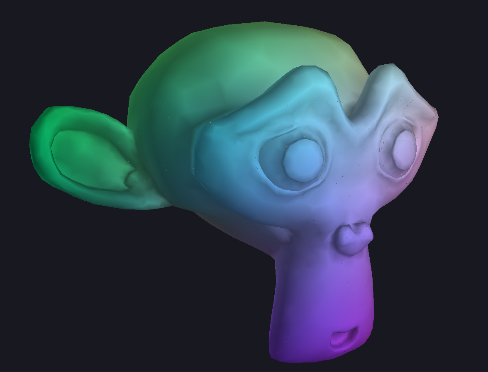
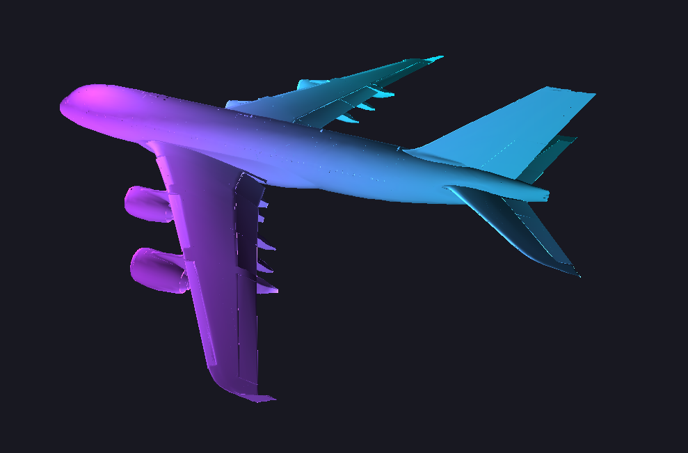

# Light-engine

An inverse rasterizer engine demo, written in java using swing. The performance isn't great, due to the slowness of the java graphics library, and the fact that most of the calculations are done in the cpu, not the gpu. Still, it's a good sample implementation of the rasterization process.  

This project is a heavily modified version of @cdehais's, @smondet's and @gmorin's rasterizer, featuring additional features such as camera movement, further optimization, and better user interface.

## Installation

This project uses gradle, so you can simply run the `gradlew build` command to build the project.

Use the `gradlew run` command to run the project.

## Usage

When starting the app, you will be prompted to select a file to load. By default, the file selector will be set to the `scenery/` directory, which contains a few sample files. You can also select a custom file from the file system, just bear in mind that any syntax errors might cause the program to crash, as very few robustness checks were made during the development (lack of time).

Once loaded, a wireframe version of your scene will be displayed. The key bindings are as follows:
- <kbd>arrows</kbd> - move the camera around
- <kbd>l</kbd> - toggle lighting
- <kbd>return</kbd> - loop between available shaders
- <kbd>f1</kbd> - set rendering mode to wireframe
- <kbd>f2</kbd> - set rendering mode to solid
- <kbd>f3</kbd> - set rendering mode to wireframe (multithreaded)
- <kbd>f4</kbd> - set rendering mode to solid (multithreaded)

The multi-threaded rendering modes are purely experimental, and have turned out to be slower than the single-threaded ones.

## Screenshots

Blender monkey "Suzanne" rendered in wireframe mode, with lighting enabled.

Blender monkey "Suzanne" rendered in solid mode, with lighting enabled.

A380 plane model rendered in solid mode, with lighting disabled.

A380 plane model rendered in solid mode, with lighting enabled.

## Disclaimer

This project was carried out as part of the Computer rendering course at [ENSEEIHT](https://www.enseeiht.fr/). I do not have complete ownership of the code, so please be careful when reusing it.
